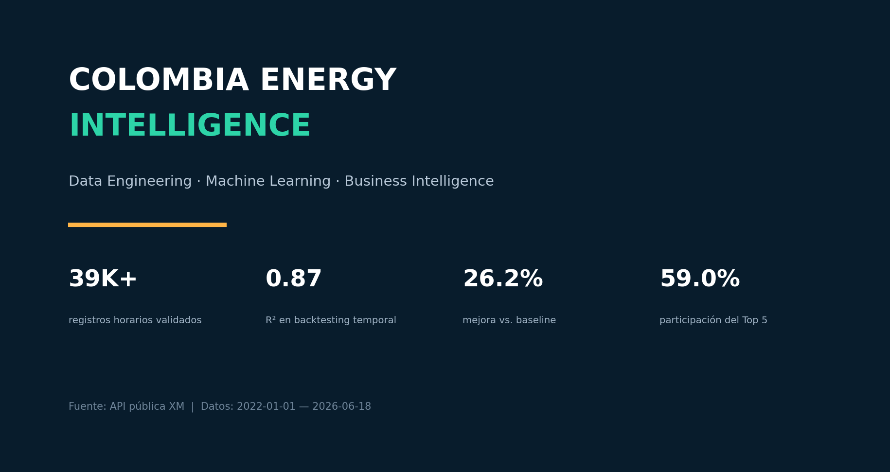
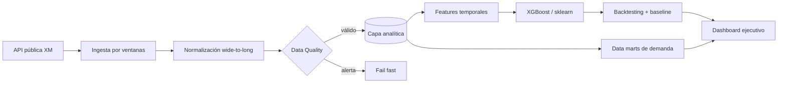

# Colombia Energy Intelligence

> Proyecto end-to-end de ingeniería de datos, machine learning y Business Intelligence aplicado al mercado eléctrico colombiano.



[Abrir dashboard ejecutivo](portfolio/dashboard.html)

## El reto

Convertir datos públicos de XM —dispersos en respuestas diarias con 24 columnas horarias— en un producto analítico que permita responder dos preguntas:

1. ¿Cómo se comportará el Precio de Bolsa Nacional en el siguiente horizonte horario?
2. ¿Qué actores concentran la demanda comercial y cómo evoluciona su participación?

## Resultado medible

| Indicador | Resultado |
|---|---:|
| Histórico de precio validado | 39.120 horas |
| Huecos, duplicados, nulos y negativos | 0 |
| Backtesting temporal | 1.441 observaciones |
| R² | 0,872 |
| MAPE | 11,24% |
| Mejora de RMSE vs. baseline | 26,16% |

Los indicadores corresponden al artefacto incluido, con datos entre 2022-01-01 y 2026-06-18. No son una promesa de desempeño futuro.

## Arquitectura



La capa de presentación consume resultados curados y no consulta directamente la API. Esa separación hace que el dashboard sea rápido, reproducible y fácil de desplegar.

## Decisiones técnicas que demuestra el proyecto

- **Ingeniería de datos:** ingestión desde API, transformación de formato ancho a serie horaria, tipado, enriquecimiento y data marts agregados.
- **Calidad:** controles de continuidad temporal, duplicados, nulos, valores negativos y observaciones extremas; modo estricto con fallo temprano.
- **Machine learning:** variables cíclicas, rezagos y ventanas móviles calculadas solo con información pasada; partición temporal y comparación contra persistencia.
- **BI:** KPIs de desempeño y calidad, ranking, concentración Top 5, HHI y tendencias normalizadas para comparación ejecutiva.
- **Software engineering:** CLI, pipeline de un comando, pruebas unitarias, artefactos autocontenidos, CI y despliegue a GitHub Pages.

## Ejecución

Crear el entorno:

```bash
conda env create -f requirements.yml
conda activate entorno_api
```

Reproducir con los datos locales incluidos:

```bash
python run_portfolio.py
```

Actualizar desde XM y entrenar en CPU:

```bash
python run_portfolio.py --refresh --backend sklearn --device cpu
```

Ejecutar pruebas:

```bash
python -m unittest discover -s tests -v
```

## Publicación como sitio

El workflow `deploy-portfolio` deja el dashboard listo para GitHub Pages en cada push a `main` o `master`. En el repositorio de GitHub, selecciona **Settings → Pages → Source: GitHub Actions**. La URL pública resultante es la que conviene pegar en el post de LinkedIn.

## Estructura relevante

```text
models/         extracción, transformación, validación y forecasting
dashboards/     capa de presentación y visualización
outputs/        datasets curados, métricas y artefactos del modelo
portfolio/      dashboard autocontenido y portada compartible
tests/          contratos básicos de transformación y calidad
run_portfolio.py orquestación reproducible
```

## Alcance y atribución

Este caso de portafolio se construyó sobre `pydataxm`, cliente open source publicado por el Equipo Analítica XM en este repositorio. El pipeline analítico, el modelo, las validaciones, los data marts, las pruebas y el dashboard constituyen la capa desarrollada para este caso. Fuente de datos: XM. El resultado es demostrativo y no constituye recomendación financiera u operativa.
