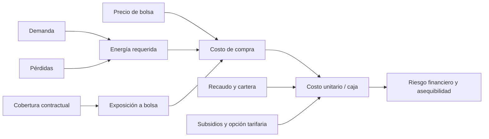

# Reto MinEnergía: asequibilidad y sostenibilidad eléctrica en el Caribe

## 1. Formulación del reto

> ¿Cómo puede el Ministerio de Minas y Energía identificar los factores que presionan la factura de energía en la región Caribe, separar sus distintas obligaciones financieras y priorizar intervenciones que protejan al usuario sin deteriorar la continuidad ni la sostenibilidad del Mercado de Energía Mayorista?

Este enfoque es más preciso que afirmar simplemente que “el consumo causa la deuda”. El valor pagado por un usuario depende del consumo y del costo unitario; la crisis financiera involucra además recaudo, pérdidas, contratación, exposición a bolsa, subsidios, opción tarifaria, inversión y obligaciones empresariales.

## 2. Hallazgos que sí soporta el repositorio

Con `DemaCome / Agente` de XM, entre enero de 2022 y diciembre de 2024:

| Operador comercial identificado | Códigos XM | Demanda | Participación en el universo |
|---|---|---:|---:|
| Afinia / Caribemar | CMMC | 26,50 TWh | 10,97% |
| Air-e | CSSC + CSIC | 26,32 TWh | 10,89% |
| Total proxy Caribe | — | 52,82 TWh | 21,86% |

Air-e cambia de `CSSC` a `CSIC` al aparecer como intervenida; deben consolidarse para no fragmentar la serie. Septiembre de 2024 contiene registros parciales de ambos códigos y se suma como un único mes del operador.

Estos datos miden demanda comercial asociada al agente. Son un **proxy de escala regional**, no consumo domiciliario georreferenciado por sí solos. XM define la demanda doméstica agregando la de los comercializadores e incorporando factores de pérdidas; un agente puede tener múltiples fronteras comerciales.

## 3. Lo que no puede concluirse solo con XM

No se puede calcular directamente:

- deuda individual o mora de hogares;
- cartera por municipio, estrato o tipo de usuario;
- tarifa final pagada en cada factura;
- recaudo efectivo;
- pérdidas técnicas frente a no técnicas;
- compras reales en contratos frente a bolsa por operador;
- subsidios causados, pagados o pendientes;
- calidad SAIDI/SAIFI por territorio.

Para estas preguntas deben integrarse SUI/Superservicios, SIMEM, CREG, MinEnergía, DANE y reportes financieros de los prestadores.

## 4. Cuatro conceptos de deuda que deben permanecer separados

| Concepto | Quién debe a quién | Qué representa | Fuente mínima |
|---|---|---|---|
| Cartera de usuarios | Usuarios → comercializador | Facturas vencidas por consumo y otros conceptos | SUI / estados financieros |
| Saldo de opción tarifaria | Diferencial tarifario diferido | CU no cobrado en su momento y recuperable posteriormente | CREG / CAC |
| Obligaciones del MEM | Comercializador → agentes del mercado | Energía, contratos, restricciones, garantías y liquidaciones | XM / ASIC |
| Subsidios por cobrar | Nación/FSSRI → prestador | Subsidios causados pendientes de giro | MinEnergía / SIIF |

No deben sumarse: cambian el acreedor, el deudor, la fecha y la naturaleza económica.

### Cifras oficiales de contexto

- A diciembre de 2024, el saldo nacional de opción tarifaria reportado por CREG era $3,307 billones: Caribemar/Afinia registraba $1,438 billones y Air-e $295.253 millones. Juntos representan aproximadamente **52,4%** del saldo nacional reportado en ese corte.
- La memoria justificativa de MinEnergía reportó para Air-e obligaciones consolidadas por **$2,273 billones a septiembre de 2025**. Es un concepto distinto al saldo de opción tarifaria y no debe sumarse con él.
- Superservicios informó que la exposición de Air-e a bolsa pasó de 55% a 14% después de medidas de contratación y que atendía alrededor de 1,4 millones de usuarios en Atlántico, Magdalena y La Guajira.
- Superservicios reportó una reducción de tarifa de Air-e de $1.072/kWh en agosto de 2024 a $796/kWh en septiembre de 2025. Esto describe una evolución tarifaria oficial, no una inferencia del modelo.

Las cifras y enlaces están versionados en [`data/reference/caribe_policy_indicators.csv`](../data/reference/caribe_policy_indicators.csv).

## 5. Cómo relacionar consumo, precio y riesgo

Se propone esta cadena causal como hipótesis, no como conclusión automática:

El repositorio genera un escenario contrafactual:

`valor proxy mensual = demanda comercial mensual × precio promedio mensual de bolsa`

Este cálculo muestra en qué meses una demanda grande habría sido más vulnerable a precios altos **si toda la energía se hubiese comprado en bolsa**. No es el costo real, porque los comercializadores combinan contratos y bolsa. El archivo resultante se llama `caribe_spot_exposure_proxy.csv` para impedir una interpretación contable incorrecta.

## 6. Componentes que explican la tarifa

La CREG expresa el costo unitario regulado como:

`CU = G + T + D + C + PR + R`

- **G:** compra de energía.
- **T:** transmisión.
- **D:** distribución.
- **C:** comercialización.
- **PR:** pérdidas reconocidas.
- **R:** restricciones y servicios asociados.

La factura del usuario también depende del consumo, subsidios o contribuciones, opción tarifaria cuando aplique y otros cobros claramente separados. Por esto, comparar únicamente el precio de bolsa con la factura sería metodológicamente incorrecto.

## 7. Modelo de datos recomendado para el Ministerio

### Tablas de hechos

- `fact_demand_hourly`: agente, frontera, fecha-hora, kWh.
- `fact_energy_purchase_monthly`: operador, contratos, bolsa, precio y cobertura.
- `fact_tariff_components`: G, T, D, C, PR, R y COT por mercado y mes.
- `fact_user_billing`: usuarios, consumo, facturación, recaudo y cartera envejecida.
- `fact_losses`: energía de entrada, facturada, pérdidas técnicas/no técnicas.
- `fact_financial_obligations`: tipo de obligación, acreedor, vencimiento y saldo.
- `fact_service_quality`: SAIDI, SAIFI, interrupciones y compensaciones.
- `fact_subsidies`: causado, validado, girado y pendiente.

### Dimensiones

- tiempo, operador, mercado de comercialización, municipio, departamento;
- estrato, sector de usuario y condición de vulnerabilidad;
- tipo de deuda, componente tarifario y fuente de datos.

Cada tabla debe conservar `cutoff_date`, `source`, `extraction_timestamp`, unidad y reglas de calidad.

## 8. KPIs para el tablero de política pública

### Asequibilidad

- factura promedio e ingreso del hogar;
- carga energética = factura / ingreso;
- tarifa efectiva COP/kWh por estrato y municipio;
- hogares subsidiados y pobreza energética;
- variación real de tarifa frente a IPC e ingresos.

### Operación

- pérdidas = (energía de entrada − energía facturada) / energía de entrada;
- SAIDI y SAIFI;
- inversión ejecutada / inversión comprometida;
- demanda atendida y demanda no atendida.

### Mercado

- exposición a bolsa = compras en bolsa / compras totales;
- cobertura contractual a 12, 24 y 36 meses;
- precio medio de contratos vs. precio de bolsa;
- costo de restricciones y sensibilidad a escenarios hidrológicos.

### Finanzas

- recaudo = pagos recibidos / facturación;
- cartera vencida por rangos 30/60/90/180 días;
- saldo de opción tarifaria por usuario y kWh;
- obligaciones vencidas del MEM;
- subsidios pendientes y días de caja.

## 9. Preguntas probables en un reto técnico

1. **¿Por qué no llamar deuda a todo el saldo?** Porque se perdería trazabilidad de deudor, acreedor, vencimiento y mecanismo de solución.
2. **¿Cómo demuestra que el Caribe consume 21,86%?** No se afirma consumo territorial exacto; se reporta participación de los agentes comerciales identificados dentro del universo XM analizado.
3. **¿Qué causa el sobrecosto?** Debe descomponerse por G, T, D, C, PR, R y COT; el precio de bolsa es solo una parte.
4. **¿Cómo probar el efecto de la exposición a bolsa?** Integrar compras reales por contratos/bolsa y estimar escenarios contrafactuales con intervalos, no usar 100% bolsa como costo observado.
5. **¿Qué política priorizar?** La decisión exige comparar impacto en tarifa, costo fiscal, reducción de riesgo MEM, tiempo de implementación y población vulnerable beneficiada.
6. **¿Cómo evitar sesgos?** Publicar cobertura, faltantes, revisiones, cambios de código, fecha de corte y diferencias entre datos operativos y financieros.
7. **¿Cómo llevarlo a producción?** Ingesta incremental, catálogo de datos, tests de calidad, conciliación entre fuentes, versionado, alertas y control de acceso a microdatos.

## 10. Líneas de intervención evaluables

- contratación de largo plazo y menor exposición a bolsa;
- reducción verificable de pérdidas con protección al usuario vulnerable;
- eficiencia energética y sustitución de equipos intensivos;
- generación distribuida y comunidades energéticas;
- focalización y oportunidad de subsidios;
- acuerdos de pago segmentados por capacidad de pago;
- recuperación de cartera pública y oficial;
- inversión de red ligada a indicadores de calidad;
- tratamiento financiero de opción tarifaria sin confundirlo con mora de usuarios.

Cada alternativa debe evaluarse con un escenario base, costo fiscal, reducción esperada de COP/kWh, efecto sobre caja, hogares beneficiados, plazo y riesgos de implementación.

## 11. Fuentes oficiales clave

- [Concepto CREG 2921 de 2025: saldos de opción tarifaria](https://normograma.superservicios.gov.co/NORMOGRAMA/compilacion/docs/concepto_creg_0002921_2025.htm)
- [Memoria justificativa MinEnergía: riesgo financiero Air-e](https://www.minenergia.gov.co/documents/14754/Memoria_justificativa_MERCADO_REGION_CARIBE_24102025.pdf)
- [Superservicios: exposición de Air-e y usuarios atendidos](https://superservicios.gov.co/Sala-de-prensa/noticias/un-ano-de-la-intervencion-de-air-e-la-superservicios-ha-garantizado-la-prestacion-del-servicio-de-energia-los-14-millones-de-usuarios)
- [Superservicios: evolución tarifaria de Air-e](https://www.superservicios.gov.co/Sala-de-prensa/noticias/tarifa-de-energia-bajo-25-durante-el-ano-de-intervencion-de-air-e)
- [MinEnergía: definición conceptual de opción tarifaria](https://www.minenergia.gov.co/documents/13854/Exposicion-Motivo-Tarifas-MME-2025.pdf)
- [CREG: fórmula y componentes del costo unitario](https://gestornormativo.creg.gov.co/gestor/entorno/docs/concepto_creg_0002921_2025.htm)
- [Glosario XM](https://www.xm.com.co/herramientas/glosario-xm)

